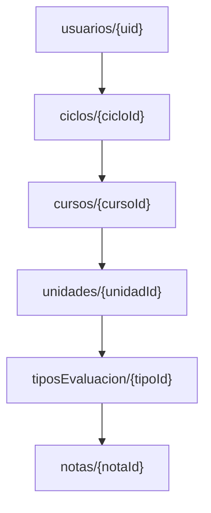

# Modelo de Datos Firestore

Este documento describe la estructura de datos anidada que se utiliza en PromedioApp para guardar un historial académico completo (Ciclos -> Cursos -> Unidades -> Tipos de Evaluación -> Notas).

> **Nota importante sobre H07 (Cálculo rápido):**
> Esta estructura anidada funciona de manera paralela a la función de "cálculo rápido" implementada en la H07. El cálculo rápido utiliza un modelo plano `ComponenteEvaluacion` guardado en `usuarios/{uid}/calculos/actual`. Ambas estructuras conviven: la de H07 es ideal para sacar un promedio veloz sin registrar un curso entero, mientras que la detallada aquí (H09) sirve para construir el expediente completo del estudiante.

## Estructura Jerárquica (Subcolecciones anidadas)

## Modelos de Datos

### Ciclo
| Campo | Tipo | Descripción |
| :--- | :--- | :--- |
| `id` | String | Identificador del documento |
| `nombre` | String | Nombre del ciclo (ej. "2026-II") |
| `fechaInicio` | Timestamp | Fecha de inicio del ciclo (opcional) |
| `fechaFin` | Timestamp | Fecha de fin del ciclo (opcional) |

### Curso
| Campo | Tipo | Descripción |
| :--- | :--- | :--- |
| `id` | String | Identificador del documento |
| `nombre` | String | Nombre del curso (ej. "Soluciones Móviles II") |
| `cicloId` | String | ID del ciclo al que pertenece (por conveniencia para queries planas) |

### Unidad
| Campo | Tipo | Descripción |
| :--- | :--- | :--- |
| `id` | String | Identificador del documento |
| `nombre` | String | Nombre de la unidad (ej. "Unidad 1") |
| `cursoId` | String | ID del curso al que pertenece |

### TipoEvaluacion
| Campo | Tipo | Descripción |
| :--- | :--- | :--- |
| `id` | String | Identificador del documento |
| `nombre` | String | Nombre (ej. "Examen Parcial", "Práctica") |
| `porcentaje` | double | Peso o porcentaje dentro de la unidad (la suma en la unidad debe ser 100%) |

### Nota
| Campo | Tipo | Descripción |
| :--- | :--- | :--- |
| `id` | String | Identificador del documento |
| `valor` | double | Valor de la nota obtenida |
| `fecha` | Timestamp | Fecha en la que se obtuvo o registró la nota (opcional) |
| `tipoEvaluacionId` | String | ID del tipo de evaluación al que pertenece |
